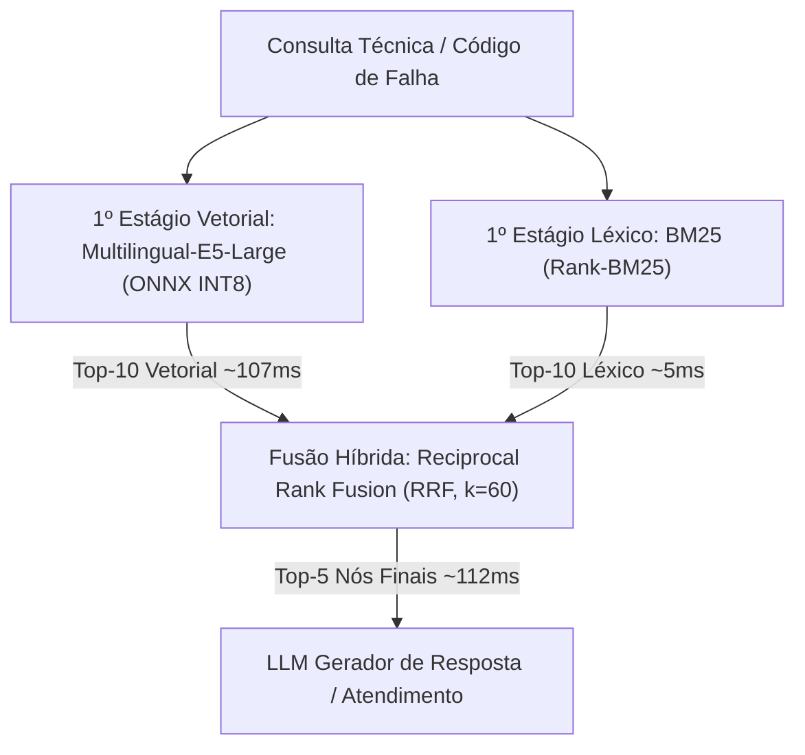

# Avaliação Científica e Tecnológica de RAG Industrial (Retrieval & Re-ranking)
## Soberania de Dados e Alta Precisão em Manuais Técnicos com Modelos Locais Quantizados

[](https://github.com/joaorura/rag_eval/releases/tag/v1.0.0-benchmark)
[](https://opensource.org/licenses/MIT)
[](https://python.org)
[](https://onnxruntime.ai/)
[](https://ollama.com/)

Repositório científico e experimental para avaliação empírica de modelos de representação vetorial (*embeddings*) e reordenadores neurais (*re-ranking*) aplicados sobre acervo técnico de **16 manuais de no-breaks industriais** da fabricante brasileira **CM Comandos Lineares**.

- **Pesquisador / Autor:** João Messias Lima Pereira
- **Contexto:** Projeto de Pesquisa Científica e Tecnológica (ICT) / Pesquisa Aplicada em Engenharia de Software
- **Parceria Institucional:** CM Comandos Lineares & Laboratório EASY / UFAL
- **Issue Oficial do Projeto:** [EASY-UFAL/cm-comandos-piad#405](https://github.com/EASY-UFAL/cm-comandos-piad/issues/405)

---

## 📌 Principais Entregáveis e Documentos (Download Direto)

Todos os relatórios formais, apresentações executivas e dados compilados estão disponíveis para visualização direta no repositório ou via release oficial:

| Entregável | Formato | Descrição | Links de Acesso |
| :--- | :---: | :--- | :--- |
| 📊 **Apresentação Executiva de Resultados** | PDF (16:9)<br>PPTX | Slides executivos para reunião técnica (12 slides com gráficos de Pareto e trade-offs) | • [Download PDF (895 KB)](https://github.com/joaorura/rag_eval/releases/download/v1.0.0-benchmark/apresentacao_pesquisa_reuniao.pdf)<br>• [Download PPTX (642 KB)](https://github.com/joaorura/rag_eval/releases/download/v1.0.0-benchmark/apresentacao_pesquisa_reuniao.pptx)<br>• [Visualizar PDF no GitHub](https://github.com/joaorura/rag_eval/blob/main/apresentacao_pesquisa_reuniao.pdf) |
| 📄 **Síntese Executiva de Decisão (ICT)** | PDF (A4) | Documento sucinto em 2 páginas sintetizando o veredito técnico e recomendação CPU | • [Download PDF (75 KB)](https://github.com/joaorura/rag_eval/releases/download/v1.0.0-benchmark/conclusoes_finais_ict.pdf)<br>• [Visualizar PDF no GitHub](https://github.com/joaorura/rag_eval/blob/main/conclusoes_finais_ict.pdf) |
| 📑 **Relatório Científico Completo de Re-ranking** | PDF | Análise aprofundada de reordenadores neurais em dois estágios (*Two-Stage RAG*) | • [Download PDF (820 KB)](https://github.com/joaorura/rag_eval/releases/download/v1.0.0-benchmark/relatorio_rerankers_dois_estagios.pdf)<br>• [Visualizar PDF no GitHub](https://github.com/joaorura/rag_eval/blob/main/docs/relatorio_rerankers_dois_estagios.pdf) |
| 📑 **Relatório Comparativo de Embeddings** | PDF | Análise detalhada dos 7 modelos de embedding do 1º estágio com testes estatísticos | • [Download PDF (144 KB)](https://github.com/joaorura/rag_eval/releases/download/v1.0.0-benchmark/relatorio_comparativo_embeddings.pdf)<br>• [Visualizar PDF no GitHub](https://github.com/joaorura/rag_eval/blob/main/docs/relatorio_comparativo_embeddings.pdf) |
| 📊 **Apresentação: Fase 1 (Embeddings)** | PDF / PPTX | Slides técnicos focados na avaliação de embeddings densos | • [Download PDF (828 KB)](https://github.com/joaorura/rag_eval/releases/download/v1.0.0-benchmark/apresentacao_embeddings.pdf)<br>• [Download PPTX (516 KB)](https://github.com/joaorura/rag_eval/releases/download/v1.0.0-benchmark/apresentacao_embeddings.pptx) |
| 📊 **Apresentação: Fase 2 (Re-ranking)** | PDF / PPTX | Slides técnicos focados no benchmark de Cross-Encoders e SLMs | • [Download PDF (920 KB)](https://github.com/joaorura/rag_eval/releases/download/v1.0.0-benchmark/apresentacao_rerankers.pdf)<br>• [Download PPTX (696 KB)](https://github.com/joaorura/rag_eval/releases/download/v1.0.0-benchmark/apresentacao_rerankers.pptx) |
| 📓 **Jupyter Notebook Executado** | `.ipynb` | Notebook completo e auditado com testes estatísticos de Wilcoxon e gráficos | • [Visualizar no GitHub](https://github.com/joaorura/rag_eval/blob/main/notebooks/avaliacao_rerankers_dois_estagios.ipynb) |

---

## 🎯 Recomendação de Arquitetura para Produção (100% CPU)

> [!IMPORTANT]
> **Premissa Operacional:** O servidor de produção da CM Comandos opera **exclusivamente em CPU (sem GPU aceleradora)**. Modelos generativos de 4B e 8B (`Qwen3-Reranker`) exigem de **20 a 40 segundos por consulta em CPU pura**, sendo inviáveis em tempo real.



### 🥇 Solução Homologada: **Busca Híbrida Leve em CPU**
1. **Pipeline:** `Multilingual-E5-Large (ONNX INT8)` + `BM25` fundidos via *Reciprocal Rank Fusion (RRF)*.
2. **Latência Total na CPU:** **~112 ms por consulta** (107 ms de inferência vetorial + 5 ms de scoring léxico BM25).
3. **Consumo de Memória:** **< 1.5 GB de RAM** (0 MB de VRAM).
4. **Custo:** **$0.00 de API**, soberania absoluta de dados industriais (*air-gapped*).
5. **Acurácia:** MRR@5 de **0.4031** (superior aos 0.3840 da OpenAI) e ancoragem léxica para códigos estritos (`DSP`, `IGBT`, alarmes `A-01` a `A-45`).

---

## 🔬 Resultados Empíricos Consolidados

### 1. Primeiro Estágio: Benchmark de Embeddings Densos ($K=5$)

Avaliação sobre 128 perguntas técnicas deduplicadas com matching engine determinístico em 3 camadas:

| Modelo | Quantização / Runtime | MRR@5 | Hit Rate@5 | Latência CPU | Latência GPU | Wilcoxon ($p$ vs OpenAI) |
| :--- | :--- | :---: | :---: | :---: | :---: | :---: |
| **`multilingual_e5_large`** | **ONNX INT8 (AVX-512)** | **0.4031** | **54.7%** | **107,5 ms** | ~20 ms | 0.5217 |
| **`multilingual_e5_base`** | **ONNX INT8 (AVX-512)** | — | — | **53,3 ms** | ~12 ms | — |
| `qwen3_8b_q4km` | Ollama GGUF (Q4_K_M) | 0.3887 | 57.0% | 379,4 ms | 57,1 ms | 0.9336 |
| `qwen3_4b_q4km` | Ollama GGUF (Q4_K_M) | 0.3844 | 55.5% | 208,2 ms | 36,0 ms | 0.9565 |
| `openai_3_small` *(Ref.)* | Cloud SaaS API | 0.3840 | 46.9% | — | 415,1 ms | *Baseline* |
| `bge_m3` | FP16 PyTorch | 0.3797 | 52.3% | — | 167,3 ms | 0.8273 |
| `nomic_embed_text` | Ollama GGUF (Q4_K_M) | 0.3021 | 35.9% | 50,5 ms | 9,8 ms | 0.0142* |
| `bertimbau_sts` | FP16 PyTorch | 0.2423 | 45.3% | — | 35,7 ms | 0.0008* |

### 2. Segundo Estágio: Re-ranking Neural ($K_{\text{cand}} = 20 \rightarrow \text{Top-5}$)

Avaliação de reordenadores neurais por atenção cruzada sobre o pool de candidatos:

| Modelo Base | Reordenador | Hit Rate@5 | MRR@5 | Δ MRR@5 | Δ HR@5 | Wilcoxon ($p$) | Latência GPU |
| :--- | :--- | :---: | :---: | :---: | :---: | :---: | :---: |
| `multilingual_e5_large` | *(Nenhum - Base)* | 54.7% | 0.4031 | — | — | *Baseline* | 0.0 ms |
| `multilingual_e5_large` | ⚡ **`bge_reranker_v2_m3`** | 57.0% | **0.4982** | **+0.0951** | +2.3% | **0.0261\*** | **1.16 s** |
| `multilingual_e5_large` | 🎯 **`qwen3_4b_q4km`** | 62.5% | 0.4764 | +0.0733 | +7.8% | **0.0406\*** | 6.21 s |
| `multilingual_e5_large` | 🏆 **`qwen3_8b_q5km`** | **65.6%** | **0.4975** | **+0.0944** | **+10.9%** | **0.0023\*** | 6.89 s |
| `multilingual_e5_large` | `rankgpt (gpt-4o-mini)` | 61.7% | 0.4573 | +0.0542 | +7.0% | 0.0510 | 1.72 s |
| `qwen3_8b_q4km` | *(Nenhum - Base)* | 57.0% | 0.3887 | — | — | *Baseline* | 0.0 ms |
| `qwen3_8b_q4km` | **`bge_reranker_v2_m3`** | 53.9% | **0.4866** | **+0.0979** | -3.1% | **0.0038\*** | **1.14 s** |
| `qwen3_8b_q4km` | **`qwen3_4b_q4km`** | **60.9%** | 0.4738 | +0.0852 | +3.9% | **0.0049\*** | 5.18 s |
| `qwen3_8b_q4km` | 🔝 **`qwen3_8b_q5km`** | 60.2% | **0.5029** | **+0.1142** | +3.1% | **0.0001\*** | 6.42 s |
| `qwen3_8b_q4km` | `rankgpt (gpt-4o-mini)` | 57.8% | 0.4663 | +0.0776 | +0.8% | 0.0160* | 1.65 s |

---

## 🛠️ Reprodução do Ambiente e Execução

### Pré-requisitos
- Python 3.12+ (gerenciado via `uv` ou `venv`)
- Ollama instalado localmente (`curl -fsSL https://ollama.com/install.sh | sh`)
- Modelos Ollama: `ollama pull nomic-embed-text`, `ollama pull qwen3-embedding:8b`, etc.

### Instalação e Execução
```bash
# 1. Clonar o repositório
git clone https://github.com/joaorura/rag_eval.git
cd rag_eval

# 2. Criar ambiente virtual e instalar dependências
python3.12 -m venv .venv
source .venv/bin/activate
pip install -r requirements.txt

# 3. Executar o benchmark de embeddings
python scripts/benchmark_embeddings.py

# 4. Executar benchmark de latência CPU vs GPU
python scripts/benchmark_cpu_embeddings.py

# 5. Executar o benchmark de re-ranking em dois estágios
python scripts/benchmark_rerankers.py
```

---

## 📄 Licença e Citação

Este projeto é disponibilizado sob a licença [MIT](LICENSE). Desenvolvido por **João Messias Lima Pereira** no âmbito do Projeto de Pesquisa Científica e Tecnológica (ICT).
